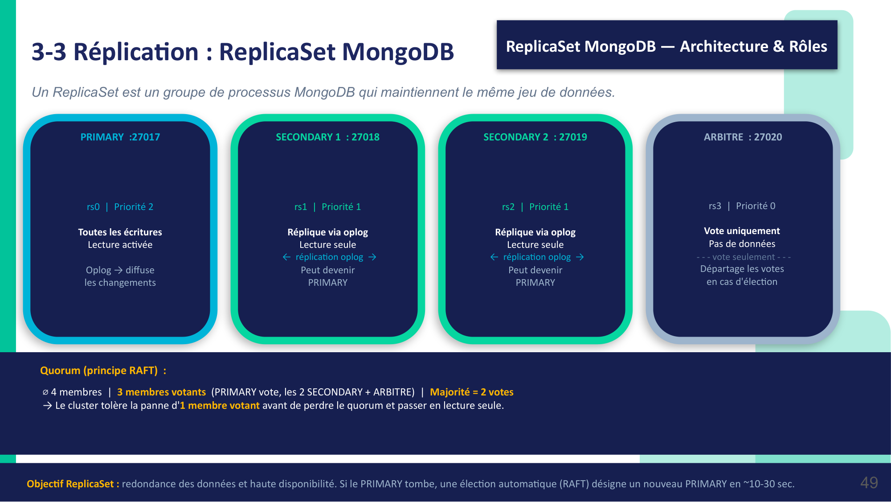
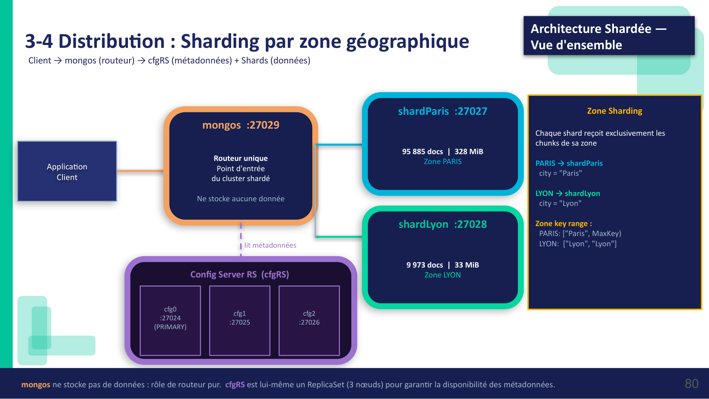
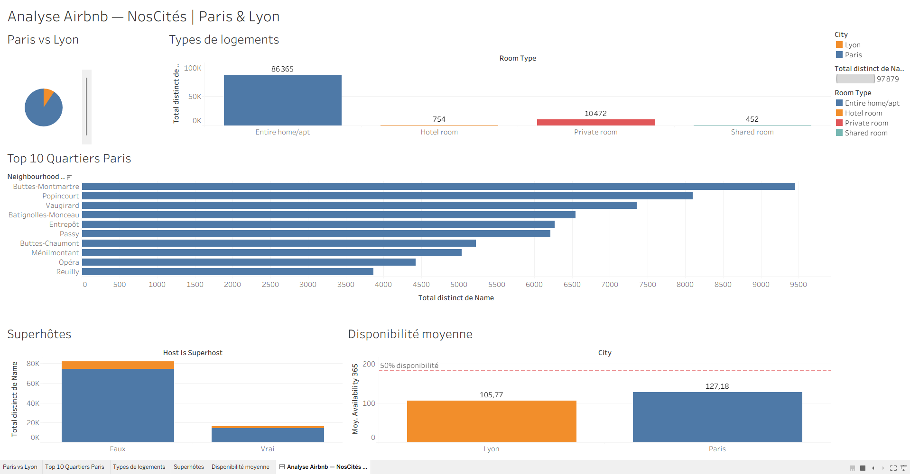

# NosCités — Base de données NoSQL distribuée (MongoDB)

Conception d'une base **MongoDB** distribuée pour des annonces de logement
(données Airbnb Paris + Lyon), avec justification argumentée du choix NoSQL.

## Problème

Stocker et interroger des annonces hétérogènes — schéma variable, listes
imbriquées (`amenities`, `host.verifications`) — avec une perspective de montée
en charge multi-villes, là où un schéma relationnel imposerait des colonnes
NULL ou un pattern EAV et des migrations à chaque évolution.

## Architecture

Deux briques MongoDB :

- **Replica set** `noscitesRS` — haute disponibilité (PRIMARY + secondaires +
  arbitre).
- **Cluster shardé** — partitionnement horizontal par ville (`city` comme shard
  key, zones dédiées), routeur `mongos` et config servers.

### Haute disponibilité — ReplicaSet `noscitesRS`



Quatre membres, trois votants. Le cluster tolère la perte d'un votant avant de
passer en lecture seule. Si le PRIMARY tombe, une élection RAFT en désigne un
nouveau en 10 à 30 secondes.

### Distribution — sharding par zone géographique



`mongos` route sans stocker de données, `cfgRS` (lui-même un ReplicaSet à trois
nœuds) porte les métadonnées. Chaque shard ne reçoit que les chunks de sa zone :
**95 885 documents Paris (328 MiB)** contre **9 973 documents Lyon (33 MiB)**.

## Stack

MongoDB (replica set, sharding, config servers, mongos) · WSL2 · Tableau ·
Python (requêtes).

## Résultats

- **105 858 annonces** réparties par sharding (95 885 Paris / 9 973 Lyon).
- Choix NoSQL justifié sur 5 axes (schéma variable, imbrication native,
  évolutivité sans migration, sharding natif, alignement modèle requête /
  application).
- Requêtes analytiques et requêtes adaptées au sharding
  (`requetes_complexes.py`, `requetes_complexes_sharding.py`).
- Restitution Tableau et dictionnaire de données.

## Restitution Tableau



Cinq vues sur une comparaison Paris / Lyon : répartition des annonces, types de
logements, top 10 des quartiers parisiens, part de superhôtes et disponibilité
moyenne sur l'année.

## Contenu

```
scripts_mongodb.md / README_scripts.md   gestion de l'infra MongoDB
start|status|stop_mongodb.sh             cycle de vie du cluster local
requetes_complexes*.py                   requêtes MongoDB (dont sharding)
schemas_mongodb.html                     schémas des collections
Data+Dictionary+(1).xlsx                 dictionnaire de données
docs/dashboard-tableau.png               rendu du dashboard (ci-dessus)
docs/slides/                             schemas d'architecture (ci-dessus)
docs/Le_Gall_Morgan_support_032026.pdf   support de soutenance complet
Classeur1.twb                            classeur Tableau source
rapport_projet_P7_v4.docx                rapport du projet
```

> Les jeux de données (CSV Airbnb, plusieurs centaines de Mo) ne sont pas
> versionnés. Sources : Inside Airbnb (Paris, Lyon).
>
> `Classeur1.twb` est le classeur **source** : il attend le CSV extrait de
> MongoDB, non versionné pour la même raison. Le rendu est l'image ci-dessus.

---

*Projet OpenClassrooms — Data Engineer (P7).*
